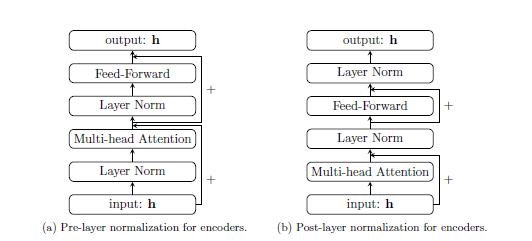
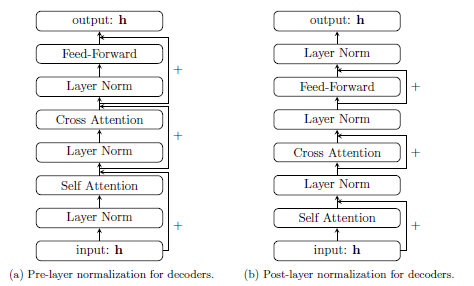

# Neural Machine Translation (NMT) using Transformer built from scratch

This project involves building a Neural Machine Translation (NMT) model from scratch using the Transformer architecture. The goal is to develop a system capable of translating French sentences into English by training on the Canadian Hansard dataset.

The analysis shows, convincing performance for something very basic Encoder, Decoder architecture. More details can be found in the analysis.pdf

